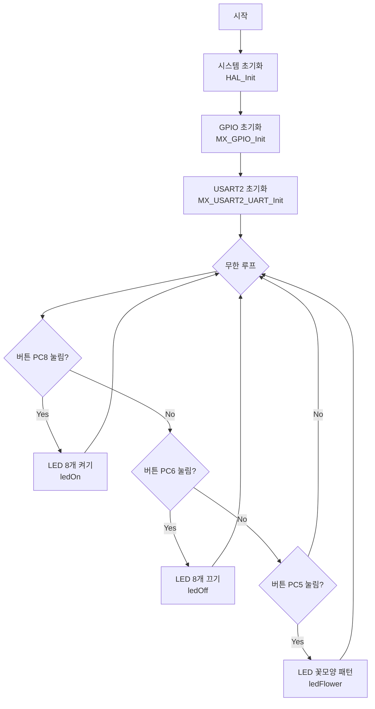
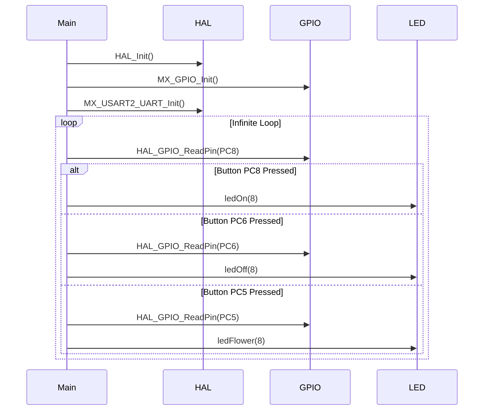

# STM32 버튼 LED 제어 프로그램 분석

## 흐름도 (Flowchart)

## 시퀀스 다이어그램 (Sequence Diagram)

## 주요 기능 설명

1. **초기화 과정**
   - HAL 라이브러리 초기화
   - 시스템 클럭 설정
   - GPIO 핀 초기화
   - USART2 통신 초기화

2. **버튼 제어 기능**
   - PC8 버튼: LED 8개 모두 켜기
   - PC6 버튼: LED 8개 모두 끄기
   - PC5 버튼: LED 꽃모양 패턴 표시

3. **LED 제어 함수**
   - ledOn(): LED 켜기
   - ledOff(): LED 끄기
   - ledFlower(): 꽃모양 패턴 표시