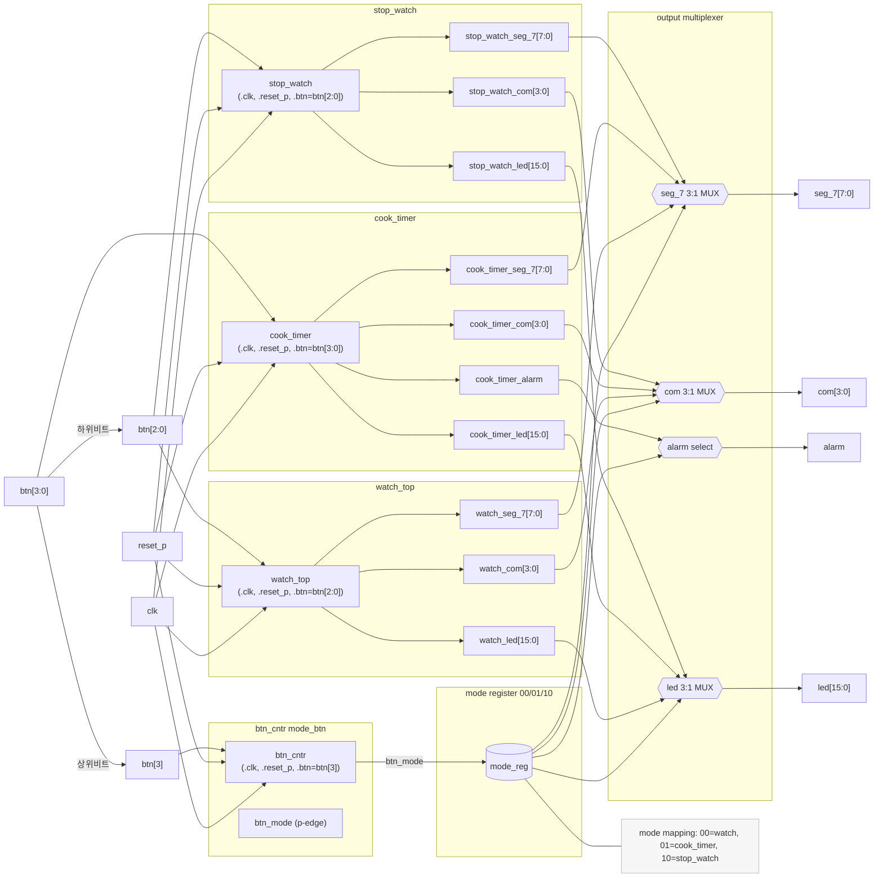
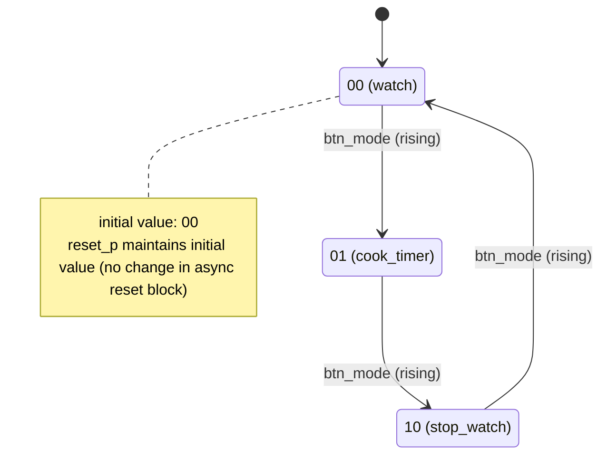

# multi_mode_watch 회로도 (Mermaid)

아래 다이어그램은 `multi_mode_watch` 상위 모듈의 블록 연결과 모드 전이(State) 동작을 나타냅니다. 필요 시 블록/연결명을 수정해 회로도를 업데이트하세요.

## 블록 다이어그램

## 모드 상태도 (btn_mode 상승엣지로 순환)

### 비고
- alarm은 cook_timer에서만 유효하며, watch/stop_watch에서는 0으로 강제됩니다.
- 버튼 디바운스/엣지 검출은 `btn_cntr`에서 처리하며, `btn[3]`의 상승엣지로 모드가 순환합니다.
- 각 서브모듈의 세부 핀/동작은 해당 모듈 정의에 따릅니다.
